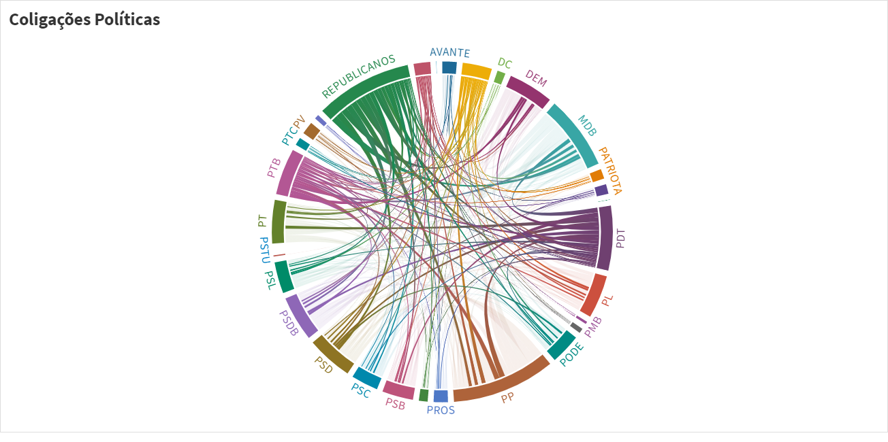

  

The political spectrum in Brazil is quite complex. We have approximately 30 political parties. They can be classified by their ideology, but that can be quite tricky. There are the ones who clearly belong to the right and left sides of the spectrum. Then there are those at the center, most of which are of the opportunistic type – their ideological pendulum swings according to those in power.

In each election the political parties can group and create coalitions to support a specific candidate. With this in mind, a natural question that arises is: how are these political coalitions connected? Are they changing with time? 

Here we make an analysis based on complex networks. This is an on-going work, we still have much to discover.  

  

